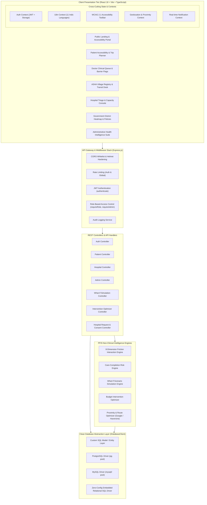

# PFIS System Architecture & Technical Design

This document provides a comprehensive technical blueprint of the **Patient Friction Intelligence System (PFIS)**—an AI-enabled healthcare operational intelligence and decision-support platform designed to identify, analyze, and resolve non-clinical barriers in healthcare journeys.

---

## 1. Architectural Philosophy & Non-Clinical Mandate

Traditional healthcare platforms focus primarily on clinical management—electronic health records (EHR), lab tests, and doctor diagnoses. PFIS addresses the critical missing link: **the operational determinants of care completion**.

```
┌────────────────────────────────────────────────────────────────────────┐
│                        PFIS OPERATIONAL SCOPE                          │
│                                                                        │
│  [Travel Distance]  [Transport Transit]  [Digital Literacy]  [Language]│
│  [Family Support]   [Documentation]      [Cost Barrier]      [Timing]  │
└───────────────────────────────────┬────────────────────────────────────┘
                                    │ Evaluates Non-Clinical Friction
                                    ▼
┌────────────────────────────────────────────────────────────────────────┐
│                   EXPLICIT NON-CLINICAL BOUNDARY                       │
│                                                                        │
│   ❌ NO Disease Diagnosis         ❌ NO Medical Prescription            │
│   ❌ NO Clinical Lab Work         ❌ NO Doctor Replacement             │
└────────────────────────────────────────────────────────────────────────┘
```

PFIS operates on the principle that clinical excellence is irrelevant if a patient cannot reach the hospital due to lack of transport, language barriers, daily wage loss, or bureaucratic friction.

---

## 2. High-Level Architecture Diagram



---

## 3. Frontend Architecture (`client/`)

The client application is built with **React 18**, **TypeScript**, and **Vite** using utility-first styling with **Tailwind CSS**.

### 3.1 Portal Routing & Layout Hierarchy
The application separates concerns across 8 distinct layout structures defined in `client/src/layouts/`:

1. **`MainLayout`**: Public information pages, landing page, about, contact, and architecture overview with responsive navigation.
2. **`AuthLayout`**: Secure login, registration, password recovery, and verified credential selector.
3. **`PatientLayout`**: Patient-facing accessibility portal, personalized friction fingerprint, nearby verified hospitals, digital document vault, trip planner, and teleconsultation navigation.
4. **`DoctorLayout`**: Clinical decision-support console, OPD patient queue with transit barrier indicators, and ASHA coordination desk.
5. **`AshaLayout`**: Frontline community health portal, village household registry, 1-tap barrier logging, and doorstep transit dispatch.
6. **`HospitalLayout`**: Hospital reception, intake coordinator, and triage console for managing incoming accessibility support requests and OPD token quotas.
7. **`GovernmentLayout`**: Macro population health oversight, district care journey drop-off leakage funnels, and policy intervention simulators.
8. **`AdminLayout`**: Master system administration, cryptographic RBAC verification, security audit logs, and global database telemetry.

### 3.2 State Management Contexts
State is decoupled into focused React context providers:
- **`AuthContext`**: Manages token verification, current user profile, role assertions, and clean logout.
- **`LanguageContext`**: Handles vernacular language selection across 11 Indian languages with dynamic `i18next` bundle resolution.
- **`AccessibilityContext`**: Implements **WCAG 2.1 AA** compliant accessibility adaptations:
  - Font scaling (Default, Large, Extra-Large)
  - High Contrast mode (yellow-on-black / dark high-contrast mode)
  - Simple Language Mode (simplifies complex medical terminology into vernacular plain text)
  - Text-to-Speech (TTS) voice assistance
  - Reduced motion preferences
- **`LocationContext`**: Acquires HTML5 browser geolocation coordinates, with intelligent fallback to default rural/urban hubs (Phagwara / Ranchi) when GPS is unavailable.
- **`NotificationContext`**: Polls and dispatches real-time operational status changes for appointments and transport requests.

### 3.3 Multilingual Localization Engine
The platform supports **11 official Indian languages**:
1. English (`en`)
2. Hindi (`hi` - हिन्दी)
3. Bengali (`bn` - বাংলা)
4. Marathi (`mr` - मराठी)
5. Tamil (`ta` - தமிழ்)
6. Telugu (`te` - తెలుగు)
7. Gujarati (`gu` - ગુજરાતી)
8. Kannada (`kn` - ಕನ್ನಡ)
9. Malayalam (`ml` - മലയാളം)
10. Punjabi (`pa` - ਪੰਜਾਬੀ)
11. Urdu (`ur` - اردو)

Translations are managed in `client/src/i18n/locales/` with real-time switching without page reload.

---

## 4. Backend Architecture (`server/`)

The backend is built with **Node.js**, **Express.js**, and **TypeScript**, configured with pure ECMAScript Modules (`ESM`).

### 4.1 Request Lifecycle & Middleware Pipeline
Every HTTP request traverses an ordered middleware pipeline:
```
1. Helmet Security Headers (CORP, CSP, HSTS)
2. CORS Origin Verification (Permissive in Dev; Strictly Whitelisted in Prod)
3. Express Rate Limiter (100 req/15min for Auth; 1,000 req/15min Global)
4. Express JSON & URL-Encoded Body Parsing (10MB payload capacity)
5. Request Routing (/api/*)
6. Authentication Guard (verify Bearer JWT -> populate req.user)
7. Role & Whitelist Authorization (requireRole / requireAdmin)
8. Controller Action
9. Audit Logging (AuditService)
10. Global Error Handler (sanitized stack traces in production)
```

### 4.2 Database Abstraction Layer (`IDatabaseClient`)
PFIS features a flexible **multi-engine database architecture** designed for both enterprise production clusters and zero-setup developer workstations.

Defined in `server/src/database/db.ts`, the interface `IDatabaseClient` exposes:
- `query<T>(sql: string, params?: any[]): Promise<QueryResult<T>>`
- `close(): Promise<void>`

Three driver implementations satisfy this contract:
1. **`PostgreSQLDriver`**: Uses `pg.Pool` with connection pooling, native transactions, and parameterized `$1, $2, ...` syntax.
2. **`MySQLDriver`**: Uses `mysql2/promise` pool with `?` parameter syntax.
3. **`EmbeddedSQLDriver`**: A zero-dependency relational SQL engine built into the server that executes queries in memory and persists transactional snapshots to `server/data/pfis_relational.json`. Allows instant local execution without installing external database servers.

---

## 5. Non-Clinical Intelligence Engines

The core analytical capabilities of PFIS are modularized in `server/src/intelligence/`:

### 5.1 8-Dimension Friction Interaction Engine (`FrictionEngine`)
Evaluates non-clinical journey barriers on a standardized scale (0–100) across 8 distinct dimensions:

| Dimension | Weight | Primary Determinants | Mitigation Strategies |
|---|---|---|---|
| **1. Travel Distance** | 15% | Kilometers to nearest hospital, road terrain, transit duration | Mobile medical vans, satellite health posts |
| **2. Transport Availability** | 18% | Public transit frequency, bus schedules, shared auto availability | Community transit shuttles, doorstep care escorts |
| **3. Digital Access** | 12% | Feature phone vs. smartphone, 2G/3G connectivity, digital literacy | Frontline worker (ASHA) assisted tokens, SMS alerts |
| **4. Vernacular Language** | 8% | Native language concordance between patient and facility staff | Multilingual signage, vernacular teleconsultation |
| **5. Family & Caregiver Support** | 12% | Dependent status, caregiver wage constraints, elderly living alone | Hospital patient navigators, buddy systems |
| **6. Documentation Readiness** | 10% | Missing scheme cards, paper prescription loss, Aadhaar verification | Digital document vault, on-site document kiosks |
| **7. Financial Accessibility** | 15% | Out-of-pocket transit fares, medicines, diagnostic fees | Ayushman Bharat cashless desk, subsidy vouchers |
| **8. Appointment Timing & Wages** | 10% | Daily wage earner loss, conflicting shift hours | Extended evening OPDs, early morning token windows |

The engine calculates both an **Overall Friction Score** and an **Accessibility Index**:
$$\text{Overall Friction Score} = \sum_{i=1}^{8} (w_i \times s_i)$$
$$\text{Accessibility Index} = 100 - \text{Overall Friction Score}$$

### 5.2 Care-Completion Risk Engine (`RiskEngine`)
Estimates the probability of patient attrition across 5 critical journey milestones:
1. Referral Acceptance
2. Consultation Attendance
3. Diagnostic Completion
4. Treatment Adherence
5. Post-Discharge Follow-Up

The engine applies logistic regression and Bayesian prior probabilities to output an explainable risk classification: **Low**, **Moderate**, **High**, or **Critical Attrition Risk**.

### 5.3 What-If Scenario Simulation Engine (`SimulationEngine`)
Enables health ministry officials, district administrators, and hospital directors to simulate the population-level impact of operational interventions before allocating capital.

Supported interventions:
- **`teleconsult`**: Assisted Teleconsultation Kiosks
- **`transport_subsidy`**: Subsidized Community Patient Shuttles
- **`diagnostic_camps`**: Mobile Village Screening Camps
- **`asha_navigators`**: Frontline ASHA Digital Health Navigators
- **`extended_opd`**: Extended Evening / Weekend OPD Shifts

The engine models **diminishing marginal returns** to prevent unrealistic additive projections:
$$\Delta P = \Delta P_{\text{baseline}} \times \left(1 - \frac{\text{Current Completion Rate}}{100}\right) \times \text{Efficiency Factor}$$

### 5.4 Intervention Optimization Engine (`OptimizationEngine`)
Solves the bounded knapsack optimization problem: given a fixed budget in INR (e.g., ₹5,00,000), select the optimal portfolio of interventions that maximizes the projected care-completion rate across a target patient cohort.

---

## 6. Proximity & Geo-Navigation Services

Defined in `server/src/services/googleMapsService.ts`:
- **Production Mode**: Integrates with the **Google Maps Distance Matrix API** and **Directions API** to obtain real-time traffic-adjusted driving durations and routes.
- **Resilient Fallback Mode**: When an API key is omitted or quota is exceeded, the service seamlessly falls back to the **Haversine Great-Circle Navigation Algorithm**:
  $$d = 2R \arcsin\left(\sqrt{\sin^2\left(\frac{\Delta \phi}{2}\right) + \cos(\phi_1)\cos(\phi_2)\sin^2\left(\frac{\Delta \lambda}{2}\right)}\right)$$
  With an average terrestrial road winding coefficient of $1.25\times$.
