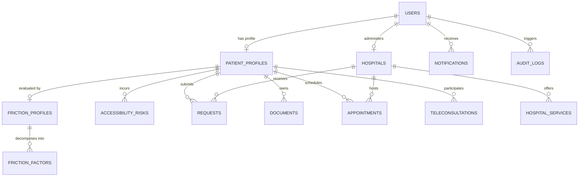

# PFIS Relational Database Architecture & Schema Specification

This document provides a comprehensive technical reference for the relational database schema, tables, foreign keys, indexes, and multi-engine driver layer powering the **Patient Friction Intelligence System (PFIS)**.

---

## 1. Multi-Engine Architecture Overview

PFIS implements a pluggable database architecture via the `IDatabaseClient` interface defined in `server/src/database/db.ts`. The platform dynamically selects or falls back across four enterprise engines:

1. **MongoDB Atlas / Document Database** (`mongodb.MongoClient`): Supported via native driver connection when `MONGODB_URI` is supplied.
2. **PostgreSQL** (`pg.Pool`): Recommended for enterprise high-availability production clusters (`DATABASE_URL` or `POSTGRES_*`).
3. **MySQL** (`mysql2/promise`): Supported for legacy hospital IT environments (`DATABASE_TYPE=mysql`).
4. **Embedded Relational SQL Engine** (`EmbeddedSQLDriver`): An in-memory, zero-dependency relational SQL engine with ACID-like transactional persistence to `server/data/pfis_relational.json`. Enables instant local execution and automated unit testing without requiring external database servers.

---

## 2. Entity-Relationship Model (ERD)

---

## 3. Schema Specification: 13 Core Relational Tables

### 3.1 `users`
Stores user authentication identities, hashed credentials, and system roles.

| Column | Type | Constraints | Description |
|---|---|---|---|
| `id` | `VARCHAR(36)` | `PRIMARY KEY` | UUIDv4 identifier |
| `email` | `VARCHAR(255)` | `UNIQUE`, `NOT NULL` | Lowercase normalized email |
| `password_hash` | `VARCHAR(255)` | `NOT NULL` | Bcrypt password hash (10 rounds) |
| `name` | `VARCHAR(255)` | `NOT NULL` | Full display name |
| `role` | `VARCHAR(20)` | `NOT NULL` | Enum: `'patient'`, `'doctor'`, `'asha'`, `'hospital'`, `'government'`, `'admin'` |
| `is_admin` | `BOOLEAN` | `DEFAULT FALSE` | Cryptographically verified admin flag |
| `phone` | `VARCHAR(30)` | `NULLABLE` | Contact telephone number |
| `google_id` | `VARCHAR(255)` | `NULLABLE` | Google OAuth2 subject ID |
| `created_at` | `TIMESTAMP` | `DEFAULT CURRENT_TIMESTAMP` | Account creation timestamp |
| `updated_at` | `TIMESTAMP` | `DEFAULT CURRENT_TIMESTAMP` | Profile modification timestamp |

---

### 3.2 `patient_profiles`
Records non-clinical, geographic, and socio-demographic accessibility parameters.

| Column | Type | Constraints | Description |
|---|---|---|---|
| `id` | `VARCHAR(36)` | `PRIMARY KEY` | UUIDv4 identifier |
| `user_id` | `VARCHAR(36)` | `FOREIGN KEY (users.id)` | Associated user account |
| `full_name` | `VARCHAR(255)` | `NOT NULL` | Patient legal name |
| `age` | `INTEGER` | `NOT NULL` | Patient age |
| `gender` | `VARCHAR(20)` | `NOT NULL` | Gender identity |
| `location` | `VARCHAR(255)` | `NOT NULL` | Address or village name |
| `is_rural` | `BOOLEAN` | `DEFAULT FALSE` | Rural vs. urban classification |
| `distance_to_hospital_km` | `DECIMAL(6,2)`| `NOT NULL` | Road distance to nearest tertiary facility |
| `transport_mode` | `VARCHAR(50)` | `NOT NULL` | e.g. `'Infrequent Bus'`, `'Walking'`, `'Auto'` |
| `digital_literacy` | `VARCHAR(50)` | `NOT NULL` | e.g. `'None / Feature Phone'`, `'Assisted'` |
| `family_support` | `VARCHAR(50)` | `NOT NULL` | e.g. `'Living Alone'`, `'Caregiver Constrained'` |
| `wage_loss_risk` | `VARCHAR(50)` | `NOT NULL` | e.g. `'Daily Wage Loss'`, `'Salaried'` |
| `preferred_language` | `VARCHAR(10)` | `DEFAULT 'en'` | ISO 639-1 language code |
| `smartphone_access` | `BOOLEAN` | `DEFAULT TRUE` | Smartphone ownership |
| `internet_type` | `VARCHAR(30)` | `DEFAULT '4G'` | Connectivity level (2G, 3G, 4G, 5G, Intermittent) |
| `disability_needs` | `TEXT` | `NULLABLE` | Mobility or physical accessibility requirements |
| `appointment_flexibility` | `VARCHAR(50)` | `NULLABLE` | Preferred arrival window (e.g. morning bus) |
| `document_readiness` | `VARCHAR(50)` | `NULLABLE` | Scheme card / referral readiness |
| `created_at` | `TIMESTAMP` | `DEFAULT CURRENT_TIMESTAMP` | Record timestamp |

---

### 3.3 `hospitals`
Verified government and private medical facilities.

| Column | Type | Constraints | Description |
|---|---|---|---|
| `id` | `VARCHAR(36)` | `PRIMARY KEY` | UUIDv4 identifier |
| `name` | `VARCHAR(255)` | `NOT NULL` | Hospital legal entity name |
| `type` | `VARCHAR(100)` | `NOT NULL` | e.g. `'Government Sub-Divisional'`, `'Private'` |
| `city` | `VARCHAR(100)` | `NOT NULL` | City / district headquarters |
| `address` | `TEXT` | `NOT NULL` | Physical street address |
| `latitude` | `DECIMAL(9,6)`| `NOT NULL` | GPS latitude coordinate |
| `longitude` | `DECIMAL(9,6)`| `NOT NULL` | GPS longitude coordinate |
| `phone` | `VARCHAR(50)` | `NOT NULL` | Reception / emergency telephone |
| `total_beds` | `INTEGER` | `DEFAULT 0` | Total bed capacity |
| `available_beds` | `INTEGER` | `DEFAULT 0` | Current unoccupied beds |
| `emergency_24x7` | `BOOLEAN` | `DEFAULT TRUE` | 24/7 emergency department availability |
| `teleconsult_available`| `BOOLEAN` | `DEFAULT FALSE`| Teleconsultation support capability |
| `accessibility_facilities`| `TEXT` | `NULLABLE` | Comma-separated badges (Ramps, Jan Aushadhi) |
| `created_at` | `TIMESTAMP` | `DEFAULT CURRENT_TIMESTAMP` | Record timestamp |

---

### 3.4 `hospital_services`
Clinical departments and daily outpatient token quotas.

| Column | Type | Constraints | Description |
|---|---|---|---|
| `id` | `VARCHAR(36)` | `PRIMARY KEY` | UUIDv4 identifier |
| `hospital_id` | `VARCHAR(36)` | `FOREIGN KEY (hospitals.id)` | Hospital facility |
| `name` | `VARCHAR(255)` | `NOT NULL` | Service/clinic title |
| `department` | `VARCHAR(100)` | `NOT NULL` | Specialty (Medicine, Cardiology, Ortho) |
| `total_daily_tokens`| `INTEGER` | `DEFAULT 50` | Maximum consultation tokens per day |
| `available_tokens` | `INTEGER` | `DEFAULT 50` | Unreserved token balance for today |
| `fee` | `DECIMAL(8,2)`| `DEFAULT 0.00` | Consultation fee in INR (₹0 for Govt) |
| `is_active` | `BOOLEAN` | `DEFAULT TRUE` | Operational availability status |

---

### 3.5 `appointments`
Outpatient token bookings linked to specific transit windows.

| Column | Type | Constraints | Description |
|---|---|---|---|
| `id` | `VARCHAR(36)` | `PRIMARY KEY` | UUIDv4 identifier |
| `patient_id` | `VARCHAR(36)` | `FOREIGN KEY (users.id)` | Patient user ID |
| `hospital_id` | `VARCHAR(36)` | `FOREIGN KEY (hospitals.id)` | Hospital facility |
| `service_id` | `VARCHAR(36)` | `FOREIGN KEY (hospital_services.id)` | Booked department |
| `scheduled_date` | `DATE` | `NOT NULL` | Appointment date |
| `time_slot` | `VARCHAR(50)` | `NOT NULL` | e.g. `'09:00 AM - 11:00 AM'` |
| `token_number` | `INTEGER` | `NOT NULL` | Assigned OPD token sequence |
| `status` | `VARCHAR(30)` | `DEFAULT 'Confirmed'` | `'Confirmed'`, `'Completed'`, `'Cancelled'` |
| `friction_notes` | `TEXT` | `NULLABLE` | Transport or wheelchair arrival instructions |

---

### 3.6 `teleconsultations`
Virtual consultation navigation and pre-visit review sessions.

| Column | Type | Constraints | Description |
|---|---|---|---|
| `id` | `VARCHAR(36)` | `PRIMARY KEY` | UUIDv4 identifier |
| `patient_id` | `VARCHAR(36)` | `FOREIGN KEY (users.id)` | Patient user ID |
| `hospital_id` | `VARCHAR(36)` | `FOREIGN KEY (hospitals.id)` | Facility providing consultation |
| `room_id` | `VARCHAR(100)`| `NOT NULL` | WebRTC virtual room identifier |
| `scheduled_at` | `TIMESTAMP` | `NOT NULL` | Scheduled date and time |
| `status` | `VARCHAR(30)` | `DEFAULT 'Scheduled'` | Status lifecycle |
| `meeting_link` | `VARCHAR(255)`| `NOT NULL` | Secure join link |

---

### 3.7 `friction_profiles`
Explainable aggregate non-clinical accessibility scores (0–100).

| Column | Type | Constraints | Description |
|---|---|---|---|
| `id` | `VARCHAR(36)` | `PRIMARY KEY` | UUIDv4 identifier |
| `patient_id` | `VARCHAR(36)` | `FOREIGN KEY (users.id)` | Patient user ID |
| `overall_score` | `INTEGER` | `NOT NULL` | Composite friction score (0–100) |
| `accessibility_score`| `INTEGER` | `NOT NULL` | Composite accessibility index (100 - score) |
| `friction_level` | `VARCHAR(20)` | `NOT NULL` | `'LOW'`, `'MODERATE'`, `'HIGH'`, `'CRITICAL'` |
| `top_barrier` | `VARCHAR(100)`| `NOT NULL` | Primary operational bottleneck |
| `secondary_barrier`| `VARCHAR(100)`| `NULLABLE` | Secondary operational bottleneck |
| `explanation` | `TEXT` | `NOT NULL` | Human-readable explanation |

---

### 3.8 `friction_factors`
Decomposed dimensional sub-scores for detailed analysis.

| Column | Type | Constraints | Description |
|---|---|---|---|
| `id` | `VARCHAR(36)` | `PRIMARY KEY` | UUIDv4 identifier |
| `profile_id` | `VARCHAR(36)` | `FOREIGN KEY (friction_profiles.id)` | Parent friction profile |
| `dimension` | `VARCHAR(50)` | `NOT NULL` | e.g. `'Transport'`, `'Cost'`, `'Language'` |
| `score` | `INTEGER` | `NOT NULL` | Dimension sub-score (0–100) |
| `weight` | `DECIMAL(4,2)`| `NOT NULL` | Dimension weight in overall formula |
| `level` | `VARCHAR(20)` | `NOT NULL` | Severity rating |
| `reason` | `TEXT` | `NOT NULL` | Specific barrier justification |

---

### 3.9 `accessibility_risks`
Identified care drop-out risks and actionable mitigation pathways.

| Column | Type | Constraints | Description |
|---|---|---|---|
| `id` | `VARCHAR(36)` | `PRIMARY KEY` | UUIDv4 identifier |
| `patient_id` | `VARCHAR(36)` | `FOREIGN KEY (users.id)` | Patient user ID |
| `risk_level` | `VARCHAR(20)` | `NOT NULL` | `'Low'`, `'Moderate'`, `'High'`, `'Critical'` |
| `barrier_title` | `VARCHAR(255)`| `NOT NULL` | Operational barrier summary |
| `explanation` | `TEXT` | `NOT NULL` | Contextual narrative |
| `mitigation_action`| `TEXT` | `NOT NULL` | Recommended resolution pathway |

---

### 3.10 `requests`
Patient intake, transport assistance, and wheelchair escort requests.

| Column | Type | Constraints | Description |
|---|---|---|---|
| `id` | `VARCHAR(36)` | `PRIMARY KEY` | UUIDv4 identifier |
| `patient_id` | `VARCHAR(36)` | `FOREIGN KEY (users.id)` | Requesting patient |
| `hospital_id` | `VARCHAR(36)` | `FOREIGN KEY (hospitals.id)` | Target hospital facility |
| `request_type` | `VARCHAR(50)` | `NOT NULL` | e.g. `'Transport Support'`, `'OPD Token'` |
| `status` | `VARCHAR(30)` | `DEFAULT 'Pending'` | `'Pending'`, `'Processing'`, `'Approved'`, `'Declined'` |
| `details` | `TEXT` | `NOT NULL` | Request description and timing details |
| `priority` | `VARCHAR(20)` | `DEFAULT 'Standard'` | `'Standard'`, `'High'`, `'Critical'` |

---

### 3.11 `documents`
Patient Digital Document Vault metadata.

| Column | Type | Constraints | Description |
|---|---|---|---|
| `id` | `VARCHAR(36)` | `PRIMARY KEY` | UUIDv4 identifier |
| `patient_id` | `VARCHAR(36)` | `FOREIGN KEY (users.id)` | Document owner |
| `category` | `VARCHAR(50)` | `NOT NULL` | `'ID Proof'`, `'Medical Document'`, `'Scheme Card'` |
| `file_name` | `VARCHAR(255)`| `NOT NULL` | Original uploaded filename |
| `file_url` | `VARCHAR(255)`| `NOT NULL` | Protected storage reference URI |
| `file_size_kb` | `DECIMAL(8,2)`| `NOT NULL` | File size in kilobytes |
| `mime_type` | `VARCHAR(100)`| `NOT NULL` | e.g. `'application/pdf'`, `'image/jpeg'` |

---

### 3.12 `notifications`
Real-time user status notifications.

| Column | Type | Constraints | Description |
|---|---|---|---|
| `id` | `VARCHAR(36)` | `PRIMARY KEY` | UUIDv4 identifier |
| `user_id` | `VARCHAR(36)` | `FOREIGN KEY (users.id)` | Recipient user |
| `title` | `VARCHAR(255)`| `NOT NULL` | Notification headline |
| `message` | `TEXT` | `NOT NULL` | Notification body |
| `type` | `VARCHAR(20)` | `DEFAULT 'info'` | `'info'`, `'success'`, `'warning'`, `'error'` |
| `is_read` | `BOOLEAN` | `DEFAULT FALSE` | Read status |
| `link` | `VARCHAR(255)`| `NULLABLE` | Direct deep-link URL |

---

### 3.13 `audit_logs`
Immutable compliance and security event trail.

| Column | Type | Constraints | Description |
|---|---|---|---|
| `id` | `VARCHAR(36)` | `PRIMARY KEY` | UUIDv4 identifier |
| `action` | `VARCHAR(100)`| `NOT NULL` | e.g. `'AUTH_LOGIN'`, `'SECURITY_UNAUTHORIZED_ADMIN_ATTEMPT'` |
| `resource` | `VARCHAR(100)`| `NOT NULL` | Target resource or route |
| `user_id` | `VARCHAR(36)` | `NULLABLE` | Performing user ID |
| `actor_role` | `VARCHAR(20)` | `NULLABLE` | Claimed actor role |
| `ip` | `VARCHAR(50)` | `NULLABLE` | Remote client IP address |
| `details` | `TEXT` | `NULLABLE` | Serialized JSON context metadata |
| `timestamp` | `TIMESTAMP` | `DEFAULT CURRENT_TIMESTAMP` | Event timestamp |
