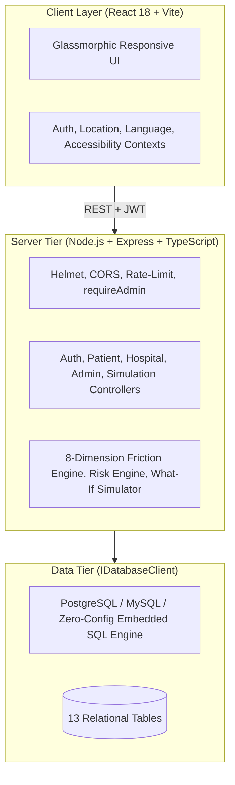

# Patient Friction Intelligence System (PFIS)

<div align="center">


[](https://www.typescriptlang.org/)
[](https://react.dev/)
[](https://vitejs.dev/)
[](https://nodejs.org/)
[](https://expressjs.com/)
[](https://www.w3.org/WAI/standards-guidelines/wcag/)
[](#-multilingual-localization-11-indic-languages)
[](LICENSE)

**An AI-enabled healthcare operational intelligence and decision-support platform that identifies, quantifies, and resolves non-clinical barriers preventing vulnerable patients from accessing and completing their healthcare journey.**

[Live Local Demo](#-quick-start--local-development) • [Architecture](ARCHITECTURE.md) • [Features](FEATURES.md) • [Security & RBAC](SECURITY.md) • [Database](DATABASE.md) • [Workflows](WORKFLOW.md) • [Testing](TESTING.md) • [Roadmap](ROADMAP.md)

</div>

---

## ⚠️ Non-Clinical Mandate

> [!IMPORTANT]
> **PFIS strictly addresses operational, geographic, financial, and logistical barriers to healthcare.**
> - ❌ It does **NOT** diagnose medical conditions or diseases.
> - ❌ It does **NOT** recommend prescription drugs or medical treatments.
> - ❌ It does **NOT** predict clinical or pathological prognoses.
> - ❌ It does **NOT** replace certified medical doctors or clinicians.
> 
> *Our singular focus is ensuring that vulnerable patients can physically, financially, and linguistically reach the clinical care they need.*

---

## 📌 Problem Statement & Solution Overview

### The Problem
In developing regions, **over 40% of patients referred to tertiary healthcare drop out** before completing consultations or diagnostic workups. Clinical failure is often not the cause—rather, patient attrition is driven by **compounding non-clinical friction**:
- Living 60+ km away with irregular, infrequent bus connections.
- Fear of losing daily subsistence wages to attend standard morning OPD hours.
- Inability to navigate digital appointment apps or read English signage.
- Lack of an able-bodied family caregiver to escort an elderly or disabled patient.
- Out-of-pocket travel and lodging costs exceeding the household's monthly disposable income.

### The Solution: PFIS
PFIS provides an explainable mathematical engine that models non-clinical operational barriers across **8 core dimensions**, estimates **care-completion drop-out risk**, connects patients to **verified low-friction facilities**, and equips health authorities with an interactive **What-If policy simulation and budget optimization engine**.

---

## 🚀 Key Platform Capabilities

```
┌──────────────────────────────┬──────────────────────────────┬──────────────────────────────┐
│        PATIENT PORTAL        │       DOCTOR CLINICAL        │      ASHA FIELD CADRE        │
├──────────────────────────────┼──────────────────────────────┼──────────────────────────────┤
│ • Hospital Travel Ease Score │ • Daily OPD Patient Queue    │ • Village Household Registry │
│ • 1-Click OPD Token Booking  │ • Non-Clinical Barrier Flags │ • 1-Tap Field Barrier Logger │
│ • Doctor Video Teleconsult   │ • Dialect & Distance Alerts  │ • Doorstep Transit Dispatch  │
│ • 7-Step Trip Planner (Twin) │ • ASHA Coordination Desk     │ • Health Card eKYC Support   │
│ • Secure Health Record Vault │ • Complete Medical Autonomy  │ • PHC Telemetry Reporting    │
├──────────────────────────────┼──────────────────────────────┼──────────────────────────────┤
│     HOSPITAL OPERATIONS      │      GOVERNMENT OFFICIAL     │         ADMIN SUITE          │
├──────────────────────────────┼──────────────────────────────┼──────────────────────────────┤
│ • Live OPD Triage Queue      │ • District Drop-Off Tracking │ • Cryptographic RBAC Control │
│ • Doctor & Quota Allocation  │ • Access Friction Heat-Maps  │ • Hospital Verification Desk │
│ • Department Capacity Desk   │ • Policy Impact Simulator    │ • Immutable Security Audit   │
│ • 24/7 Emergency Telemetry   │ • Mobile Van Allocation Tool │ • Population Telemetry Logs  │
│ • Free Shuttle Coordination  │ • DPDP 2023 Privacy Standard │ • System Health Diagnostics  │
└──────────────────────────────┴──────────────────────────────┴──────────────────────────────┘
```

---

## 🛡️ Secure Admin Role & Access Control (RBAC)

PFIS enforces a **production-grade dual-layer RBAC architecture**. Administrative privileges are strictly locked to cryptographically verified emails at both database and middleware levels:

### Authorized System Administrators
The following accounts are permanently authorized as administrators:

| Administrator | Email Address | Role | Status |
|---|---|---|---|
| **Satyam Kumar** | `satyam31sk@gmail.com` | `admin` | Verified Administrator |
| **Prince Patel** | `prince.patel2025@lpu.in` | `admin` | Verified Administrator |
| **Dhiraj Kumar** | `dhirajkumar464748@gmail.com` | `admin` | Verified Executive Administrator |
| **Xel Admin** | `xel5760@gmail.com` | `admin` | Verified Administrator |
| **Tanishka** | `tanishka2789@gmail.com` | `admin` | Verified Administrator |
| **Dishika** | `ddishika45@gmail.com` | `admin` | Verified Administrator |
| **Root System Admin**| `admin@pfis.org` | `admin` | Verified System Master |

> [!NOTE]
> All unauthorized tokens or registration attempts claiming `role: 'admin'` are automatically demoted to `'patient'`, blocked with `403 Forbidden`, and flagged in the security audit trail.

---

## 🌐 Multilingual Localization (11 Indic Languages)

PFIS supports real-time, dynamic localization without page reloads across **11 official Indian languages**:

| Language | Native Script | Code | Status |
|---|---|---|---|
| **English** | English | `en` | Full Coverage |
| **Hindi** | हिन्दी | `hi` | Full Coverage |
| **Bengali** | বাংলা | `bn` | Full Coverage |
| **Marathi** | मराठी | `mr` | Full Coverage |
| **Tamil** | தமிழ் | `ta` | Full Coverage |
| **Telugu** | తెలుగు | `te` | Full Coverage |
| **Gujarati** | ગુજરાતી | `gu` | Full Coverage |
| **Kannada** | ಕನ್ನಡ | `kn` | Full Coverage |
| **Malayalam** | മലയാളം | `ml` | Full Coverage |
| **Punjabi** | ਪੰਜਾਬੀ | `pa` | Full Coverage |
| **Urdu** | اردو | `ur` | Full Coverage |

---

## ♿ WCAG 2.1 AA Accessibility Suite

A persistent floating accessibility toolbar empowers elderly and low-vision patients with:
- **Font Sizing**: Scale interface typography up to 130%.
- **High Contrast**: Yellow-on-black and dark high-contrast mode for cataract patients.
- **Simple Language Mode**: Dynamically translates technical medical jargon into plain vernacular sentences.
- **Text-to-Speech (TTS)**: On-screen friction explanations and instructions read aloud using native speech synthesis.
- **Reduced Motion**: Disables all animations for vestibular safety.

---

## 🏗️ System Architecture



For complete architectural specifications, see [ARCHITECTURE.md](ARCHITECTURE.md).

---

## 🗄️ Relational Database (13 Core Tables)

PFIS operates on a clean **13-table relational schema** with foreign keys, cascading constraints, and indexes:

1. `users` — User credentials, role (`patient`, `hospital`, `admin`), and `is_admin` flag.
2. `patient_profiles` — Socio-geographic and operational accessibility parameters.
3. `hospitals` — Verified healthcare facilities, bed capacity, emergency status.
4. `hospital_services` — OPD departments, daily token quotas, available seats.
5. `appointments` — Scheduled consultation tokens linked to transit arrival windows.
6. `teleconsultations` — WebRTC virtual consultation sessions and meeting links.
7. `friction_profiles` — Explainable aggregate non-clinical accessibility scores (0–100).
8. `friction_factors` — Decomposed dimensional sub-scores and weights.
9. `accessibility_risks` — Drop-out risk severity ratings and mitigation actions.
10. `requests` — Patient intake, transit shuttle, and wheelchair escort requests.
11. `documents` — Patient Digital Document Vault metadata.
12. `notifications` — Real-time user operational status alerts.
13. `audit_logs` — Immutable activity and security audit trail.

For detailed schema definitions, data types, and ER diagrams, see [DATABASE.md](DATABASE.md).

---

## 💻 Tech Stack

### Frontend
- **Framework**: React 18 & Vite (TypeScript)
- **Styling**: Tailwind CSS & Lucide React Icons
- **Mapping**: Leaflet, OpenStreetMap, Esri Satellite, Google Maps Integration
- **Charts**: Recharts (Friction distributions, leakage funnels, sensitivity curves)
- **Internationalization**: `i18next` with HTTP Language Detector

### Backend
- **Runtime**: Node.js 22+ (ECMAScript Modules)
- **Framework**: Express.js (TypeScript)
- **Database Layer**: Custom `IDatabaseClient` supporting PostgreSQL (`pg`), MySQL (`mysql2`), MongoDB Atlas (`mongodb`), and zero-setup Embedded Relational SQL
- **Pluggable Multi-Engine Architecture**: Dynamically connects to PostgreSQL, MySQL, or MongoDB Atlas when configured, with automated fallback to the zero-dependency Embedded Relational SQL engine.

---

## ⚡ Quick Start & Local Development

### Prerequisites
- Node.js 18+ installed on your system.
- Git.

### 1. Clone & Install Dependencies
```bash
git clone https://github.com/Learntagus-Tech-SIH/PFIS-Patient-Friction-Intelligence-System.git
cd PFIS-Patient-Friction-Intelligence-System

# Install server dependencies
npm --prefix server install

# Install client dependencies
npm --prefix client install
```

### 2. Configure Environment
A ready-to-use `.env` is provided. To customize:
```bash
cp .env.example .env
```

Key environment variables:
```env
PORT=5000
DATABASE_TYPE=auto
JWT_SECRET=pfis_super_secure_jwt_secret_key_2026_sih
CLIENT_URL=http://localhost:5173
NODE_ENV=development
ADMIN_EMAILS=satyam31sk@gmail.com,prince.patel2025@lpu.in,dhirajkumar464748@gmail.com,xel5760@gmail.com,tanishka2789@gmail.com,ddishika45@gmail.com,admin@pfis.org
```

### 3. Run Development Servers
Open two terminal windows:

**Terminal 1 (Backend Server)**:
```bash
npm --prefix server run dev
```
*Backend runs on `http://localhost:5000` with the embedded relational SQL engine automatically initialized and seeded.*

**Terminal 2 (Frontend Client)**:
```bash
npm --prefix client run dev
```
*Client runs on `http://localhost:5173`.*

---

## 🔑 Verified Demo Credentials

For instant demonstration access, use these pre-seeded database accounts (or click the 1-click login buttons on the login page):

| Role | Email Address | Password | Portal URL |
|---|---|---|---|
| **Authorized Admin** | `satyam31sk@gmail.com` | `Admin@123` | `/admin/dashboard` |
| **Authorized Admin** | `prince.patel2025@lpu.in` | `Admin@123` | `/admin/dashboard` |
| **Authorized Admin** | `dhirajkumar464748@gmail.com` | `Admin@123` | `/admin/dashboard` |
| **Authorized Admin** | `xel5760@gmail.com` | `Admin@123` | `/admin/dashboard` |
| **Authorized Admin** | `tanishka2789@gmail.com` | `Admin@123` | `/admin/dashboard` |
| **Authorized Admin** | `ddishika45@gmail.com` | `Admin@123` | `/admin/dashboard` |
| **Hospital Staff** | `hospital@apollo.org` | `Hospital@123` | `/hospital/dashboard` |
| **Demo Patient** | `patient@pfis.org` | `Patient@123` | `/patient/dashboard` |

---

## 🧪 Automated Testing & Verification

PFIS includes a standardized, automated regression and security test suite:

```bash
# Run the complete automated API & RBAC regression suite (under 3 seconds)
npm test

# Verify production builds for backend and frontend
npm run build
```

For complete testing methodology, test matrix, and verification output, see [TESTING.md](TESTING.md).

---

## 📚 Enterprise Documentation Suite

The repository contains an enterprise-grade documentation suite covering every dimension of engineering, security, deployment, and architecture:

| Document | Purpose |
|---|---|
| 🚀 [**DEPLOYMENT.md**](DEPLOYMENT.md) | Multi-stage Docker, Compose, Nginx reverse proxy, and cloud deployment runbooks. |
| 💻 [**DEVELOPMENT.md**](DEVELOPMENT.md) | Local development setup, coding standards, Monorepo conventions, and debugging. |
| 📡 [**API.md**](API.md) | Complete OpenAPI-compliant REST reference with schemas, status codes, and auth headers. |
| 🛡️ [**SECURITY.md**](SECURITY.md) | Threat modeling, RBAC whitelist, password hashing, and vulnerability reporting. |
| 📐 [**ARCHITECTURE.md**](ARCHITECTURE.md) | Technical blueprint, non-clinical mandate, multi-client DB abstraction, and engines. |
| 🗄️ [**DATABASE.md**](DATABASE.md) | Detailed relational schema specifications for all 13 tables, foreign keys, and indexes. |
| 🔄 [**WORKFLOW.md**](WORKFLOW.md) | Operational user journeys with Mermaid sequence and state machine diagrams. |
| 🧪 [**TESTING.md**](TESTING.md) | Quality assurance hierarchy, automated regression suites, and verification matrix. |
| 💡 [**FEATURES.md**](FEATURES.md) | Complete feature catalog for Patient Portal, Hospital Console, and Admin Suite. |
| 🤝 [**CONTRIBUTING.md**](CONTRIBUTING.md) | Contributor guidelines, code of conduct, conventional commits, and PR checklist. |
| 📝 [**CHANGELOG.md**](CHANGELOG.md) | Semantic versioning release log and milestone breakdown. |
| 🗺️ [**ROADMAP.md**](ROADMAP.md) | Strategic evolution milestones, ABDM integration, and frontline ASHA mobile app. |
| 🧠 [**MEMORY.md**](MEMORY.md) | Persistent institutional context bank, architectural pivot history, and formula index. |

---

## 🤝 Contributing

Contributions to PFIS are welcome! Please follow these steps:
1. Fork the repository.
2. Create a feature branch (`git checkout -b feature/AmazingFeature`).
3. Ensure all tests pass (`npm --prefix server run build && npm --prefix client run build`).
4. Commit your changes (`git commit -m 'Add some AmazingFeature'`).
5. Push to the branch (`git push origin feature/AmazingFeature`).
6. Open a Pull Request.

---

## 📄 License

Distributed under the MIT License. See `LICENSE` for more information.

---

<div align="center">
  <b>Patient Friction Intelligence System (PFIS)</b> • <i>Empowering Equitable Healthcare Access</i>
</div>
