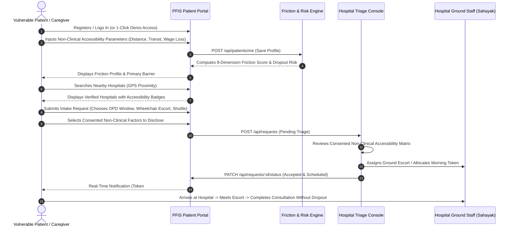
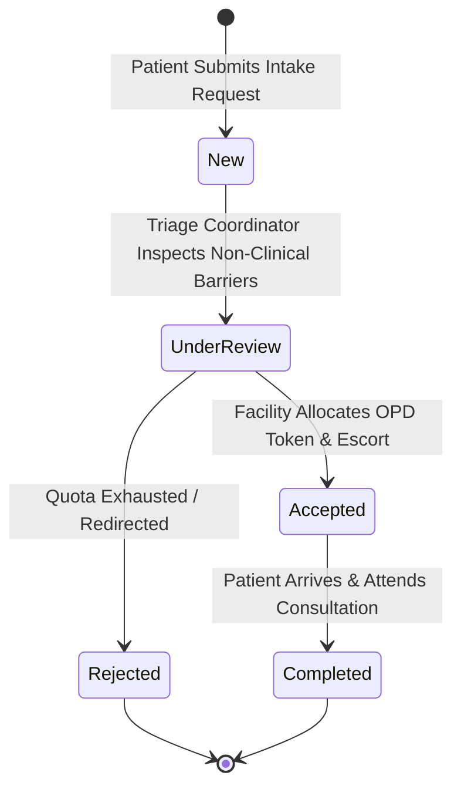
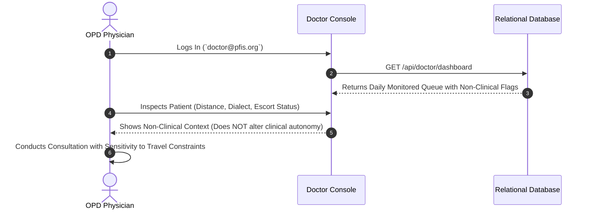
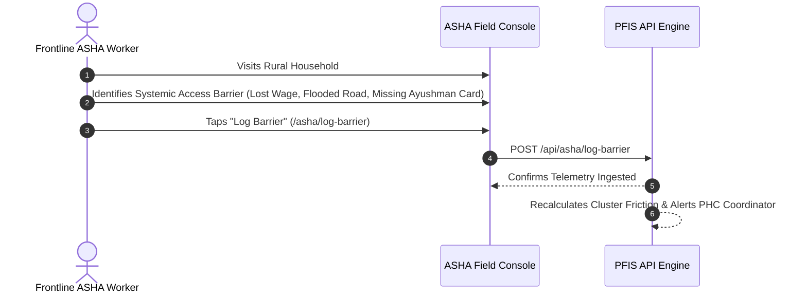
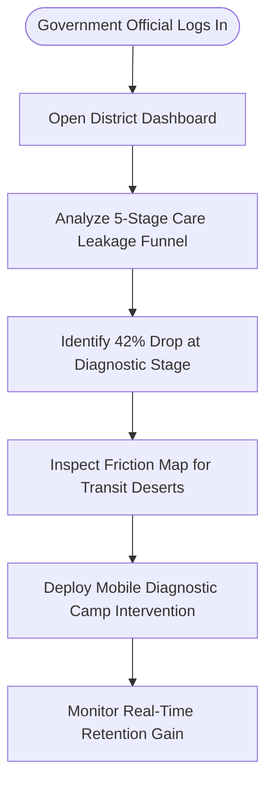
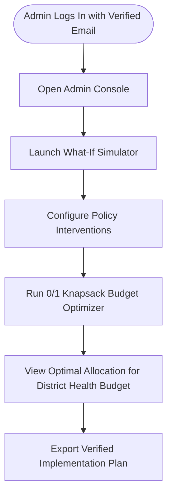
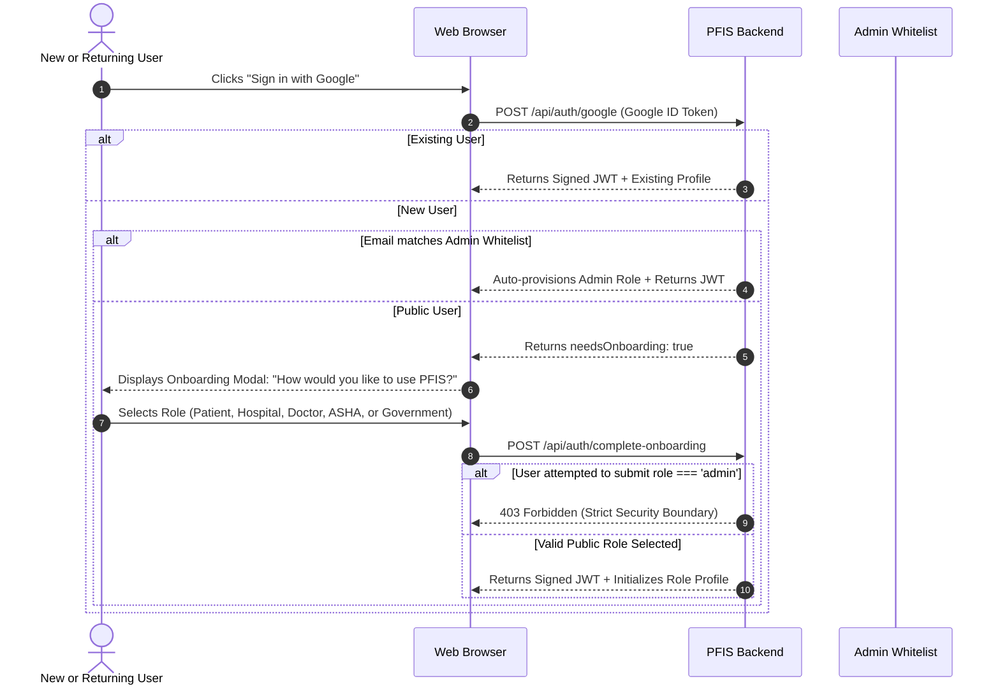

# PFIS Operational Workflows & User Journeys

This document outlines the end-to-end operational workflows, state machines, and user journeys executed across the **Patient Friction Intelligence System (PFIS)** for all 6 user roles.

---

## 1. Patient Healthcare Journey Workflow

---

## 2. Hospital Triage & Token Quota Workflow

### Operational Steps for Hospital Staff:
1. **Intake Queue** (`/hospital/requests`): Coordinator reviews incoming access requests.
2. **Barrier Inspection**: Reviews patient travel constraints (e.g. *"Arrives on 09:15 bus from 60 km; requires ground-floor wheelchair ramp"*).
3. **Capacity Allocation**: Assigns morning token and alerts ground ramp concierge.
4. **Quota Update**: Decrements available department token quota in real time.

---

## 3. Doctor Clinical Queue & Non-Clinical Guidance Workflow

---

## 4. ASHA Field Cadre Doorstep Logging Workflow

---

## 5. Government Policy & District Intervention Workflow

---

## 6. Admin Master Simulation & 0/1 Knapsack Optimization

---

## 7. Google OAuth & Role Onboarding Lifecycle

