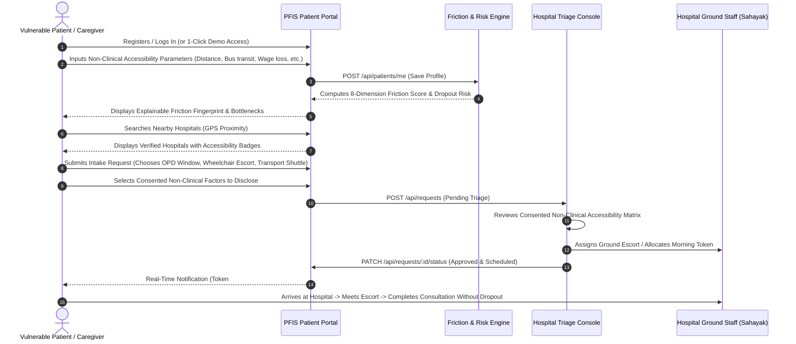
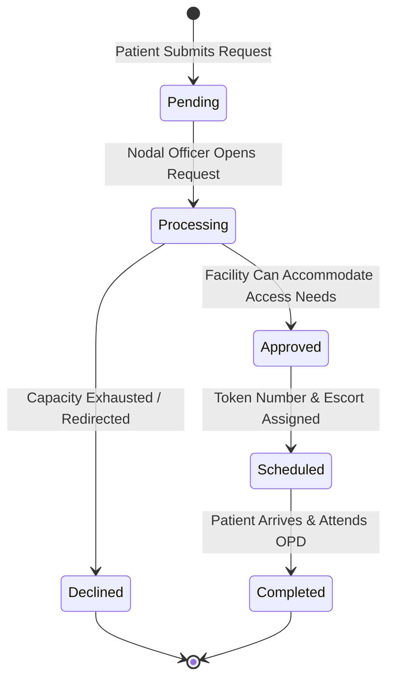
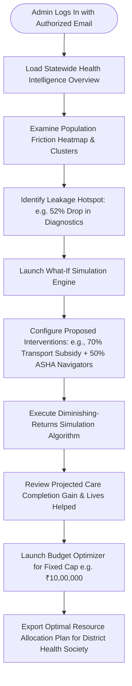
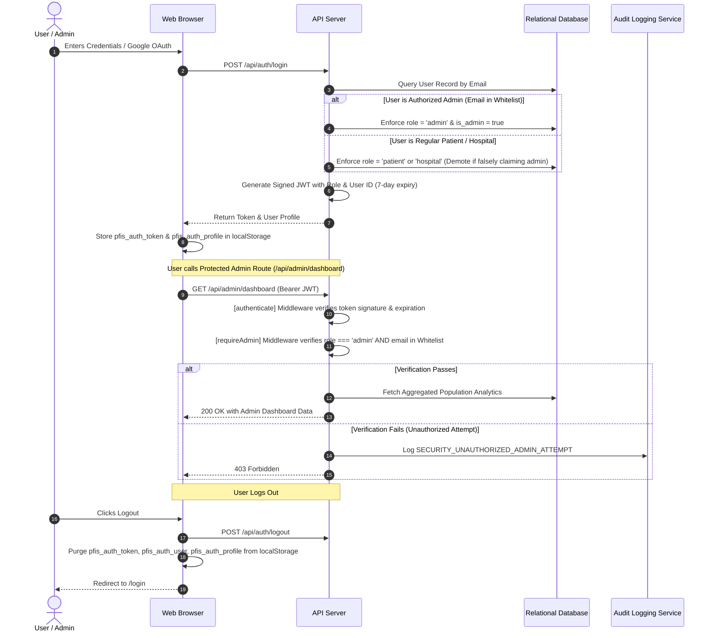

# PFIS Operational Workflows & User Journeys

This document outlines the end-to-end operational workflows, state machines, and user journeys executed across the **Patient Friction Intelligence System (PFIS)**.

---

## 1. End-to-End Patient Journey Workflow

### Key Stages Explained:
1. **Intake & Demographics**: The patient or an ASHA health worker records the patient's distance from the facility, transit frequency, phone type, literacy level, caregiver availability, and daily wage dependency.
2. **Explainable Scoring**: The system calculates the friction score (0–100) and displays plain-language mitigation actions.
3. **Consent Handshake**: The patient decides exactly which operational factors (e.g., mobility disability, transit schedule) are transmitted to the receiving hospital.
4. **Closing the Loop**: The hospital nodal officer reviews the request, reserves an OPD token matching the patient's transit arrival, and arranges a ramp concierge.

---

## 2. Hospital Triage & Token Quota Workflow

### Operational Steps for Hospital Staff:
1. **Request Intake**: Staff navigate to `/hospital/requests` to review the prioritized queue.
2. **Accessibility Inspection**: Staff review the patient's consented barriers (e.g., *"Patient arriving by 09:30 AM bus; needs wheelchair ramp assistance at Gate 1"*).
3. **Action Allocation**: Staff assign a patient concierge or reserve a subsidized transport seat.
4. **Token Decrement**: The department's daily token counter automatically decrements to prevent overcrowding.
5. **Patient Notification**: An automatic notification is dispatched to the patient's dashboard with arrival instructions.

---

## 3. Administrative Policy & What-If Simulation Workflow

### Operational Steps for Administrators:
1. **Monitor Drop-out Leakage**: Review the 5-stage patient attrition funnel (`/admin/care-leakage`) to identify where patients are lost.
2. **Attribute Failure Root Causes**: Run Why Care Failed attribution (`/admin/care-failure`) to separate transit failure from financial or documentation barriers.
3. **Simulate Interventions**: Use `/admin/simulator` to test policy packages and assess whether community transport vouchers yield higher completion rates than teleconsultation kiosks.
4. **Optimize Expenditure**: Input available district funding into `/admin/interventions` to receive an optimal knapsack allocation.

---

## 4. Authentication, RBAC & Security Session Lifecycle

